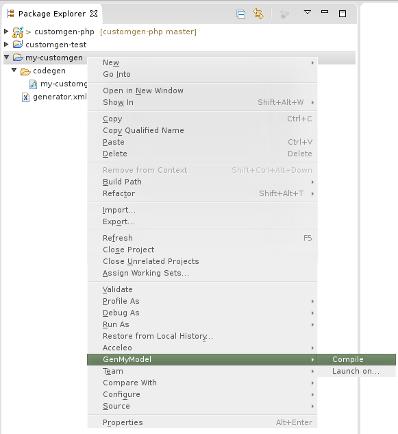
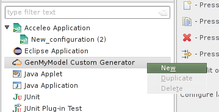

# GenMyModel Custom Generator Plugin for Eclipse

Custom generator development can be difficult when you are not used to UML metamodel. The commit-push routine in order to test changes can be heavy. We thus develop an Eclipse plugin that allows you to compile and launch a GenMyModel. Thanks to the plugin you can easily benefit from the Acceleo editor and its code completion feature.

The Eclipse plugin allows you to:

* compile your custom generator project (_i.e._, your `.mtl` files),
* launch your custom generator on one of your GenMyModel model project.
* create custom generator project (file hierarchie, simple file...)

Please note that the custom generator compilation can be made without this Eclipse plugin, by using the Acceleo build engine. You do not have to necessarily use the compilation service proposed by this plugin.

* If you don't have Eclipse in your computer, you can follow the Eclipse installation process described [here](https://github.com/Axellience/customgen-documentation/blob/master/importExisting.md).
* To install this Eclipse plugin, please follow [this](https://github.com/Axellience/gmm-eclipse-plugins) installation process. You can find the `.jar` at the same URL.

## How to create a new cutom generator project in Eclipse

With the Eclipse plugin, a GenMyModel new project category can be found.

1. Choose `File -> New`,
2. `Project...`
3. Select `GenMyModel` and clic on `Custom Generator Project`then `Next`.

The custom generator wizard page should open. Fill the asked information (project name, if yes or no your project will contain model to model transformations), then clic on `Finish`.

You can see in your `Project Explorer` a new custom generator project with a small first Acceleo template and all the required files and hierarchie.

## How to compile your code in Eclipse

Obviously, you must have a custom generator project. In the `Package Explorer` view or the `Project Explorer` one, right clic on your project (`my-customgen` is selected in this screenshot). You should see a `GenMyModel` menu. In this menu, simple select `Compile` to launch the compilation process.

Once the compilation process is launched, you can see the progress in the status bar.

The compilation can take time as it communicates with the GenMyModel API. If the compilation has passed without errors, ou should be able to see the `.emtl` result in your project.

If errors occurs during your project compilation, a window will pop up with the encountered errors.

## How to launch your generator in Eclipse

In order, to launch your custom generator, your project must be already compiled using either the GenMyModel compile menu (see previous point) or the default Acceleo compiler. Be sure that the `.emtl` files are in the same directory than the `.mtl` (in the `codegen` directory).
> You have to use your GenMyModel login and password. So, **if you use** your Github account or your Google+ account to log in, you must ask for a password in order to be able to launch your custom generator from GenMyModel.

There is two ways (very similar) to launch a GenMyModel custom generator in Eclipse:
* using a run configuration,
* using the `Launch on...` menu.

In this tutorial, we will show you how to use the run configuration dialog as the `Launch on...` menu is only a pre-configuration for the run configuration method.

1. Open the Run configuration dialog.

1. Under the `GenMyModel Custom Generator` category, right clic and choose `New` (or double clic on the category).

1. A new run configuration should be created. Select the custom generator you want to launch (in our case, `my-customgen`) then, enter your GenMyModel login and password. By clicking on `Refresh` you should be able to see your project. Select one of them and finally clic on `Apply` then`Run`.

The generation result will be placed in your custom generator project, in a directory named by your project.

