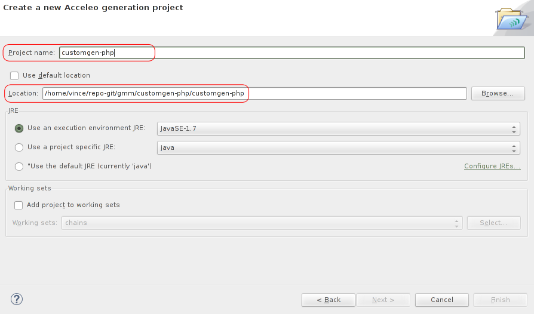

# How to Configure your Computer to Easily Develop Custom Generators for GenMyModel

In this little tutorial, we will see how to configure your desktop environement in order to easily code or modify
custom generators.

## IDE and Language Installation

* The general used environement for this tutorial is [Eclipse Kepler](http://www.eclipse.org/). We recommand you to download
the Eclipse modeling flavour which comes with a set of useful pre-installed plugins <https://www.eclipse.org/downloads/packages/eclipse-modeling-tools/keplersr2>.
* The main used language that allows you to go from models to code is [Acceleo](http://www.eclipse.org/acceleo/).

The install steps for Eclipse and Accelo are the following:

1. Download [Eclipse Modeling](https://www.eclipse.org/downloads/packages/eclipse-modeling-tools/keplersr2).
1. Uncompress the recovered archive and launch Eclipse.
1. Once Eclipse is launched, go to `Help` menu, then `Install Modeling Components`.
1. Select `Acceleo`, then clic on `Finish`.

Once Acceleo is notified as installed, restart your freshly installed Eclipse IDE. If everything's allright, you should be able to code with Acceleo right now.
There is just a little final thing you can do (optionnal), you can disable Acceleo notifications. To my mind, they are more annoying than helpful, but you can
let them is you prefer. So, to disable them, go to `Window` then `Preferences`, expand the `Acceleo` menu, clic on `Notification` then select `Deactivate all notifications`.

## Importing an Existing Custom Generator (ex: PHP custom gen)

Importing a custom gen is really easy as it is hosted on a git repository. However, you must be careful by importing the project root and you also should also add a little
bit of configuration on it. First, you should `fork` and `clone` an existing custom generator somewhere.
Indeed, custom generator provided are often only basic custom generators. If you want to modify it, you should `fork` it ;). I forked the [customgen-php](https://github.com/Axellience/customgen-php) repository to <https://github.com/aranega/customgen-php>. Then, I cloned it  (*e.g*, under *UNIX* like systems):

	$ git clone https://github.com/aranega/customgen-php.git (I forked and cloned it to be able to push modification)

Then, in your eclipse IDE:
1. Clic on `File -> import`, select `Git`choose `Projects from Git` and clic on `Next`.
2. On the next window, choose `Existing local repository` and `Add` the root of the repository where the custom generator is cloned in. 
3. The next window ask you of you want to use and existing project wizard. Select `Use the New project Wizard` and finally, clic on `Finish` (we are almost there). 
4. As promised, a `New project` window should open. In this window, select `Acceleo model to text` and choose
`Acceleo Project`.
5. Now it is the final import step but also the most sensible. __You have to unselect the `Use default location` option__ and __browse for the custom generator directory inside the cloned repository__ on your hard drive.
6. Finally, put the generator directory name as `project name`. You can now clic on `Finish` ( yeay \o/ ).

For example: in the next figure, I cloned the PHP custom generator into `/home/vince/acceleo-tut/customgen-php`. Into this directory, there is the custom generator directory called `customgen-php`, this is this one I select. To sum up, in the `Location` field, I put `/home/vince/acceleo-tut/customgen-php/customgen-php` and as `project name`, I put `customgen-php`.

Once your project is imported, it should have errors, don't worry! Acceleo wizard has created many files you don't need (GenMyModel engine performs a lot of work to hide most of this). You can delete `src` directory, you don't need it. Actually, you only have to deal with acceleo editor which is very helpful. Now open the `.mtl` files (in `codegen`directory) and you can start coding!

## How to Test my Modifications

To launch or test your modifications, here is the current process (this process will change a little bit . You added code you want to test or include in the generator? Simply `push` it your forked repository and launch it in GenMyModel (if you already registered it).

## A Little Example on PHP Custom Generator

Try to add this in the `.mtl` file, in the `genClass(c : Class)` template:

	[template public genClass(c : Class)]
	<?php[c.generalization.genRequire()/]
	class [c.name/][c.generalization.genGeneralization()/] {
	// This is a comment for the [c.name/] class              ---> Added code
		[c.attribute.genAttribute()/]
	}
	?>
	[/template]

Then, push it on your forked repository and launch it in GenMyModel. Finally, enjoy the result!
