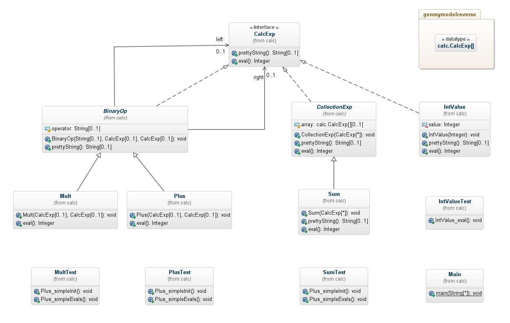

# GenMyModel Reverse Engineering, Getting Started

In this little tutorial, we will approach GenMyModel reverse engineering facilities and learn how to shape the model with the options
on a simple github repository: [https://github.com/Axellience/reverse-example]().

## Simple reverse engineering

First, lets operate a reverse engineering with default options. In the dashboard:

1. Go to `Projects`.
1. Click on `Reverse from Java`.
1. Enter a unique project name.
1. Put [https://github.com/Axellience/reverse-example]() as git repository.

You have now parametered the reverse engineering engine. Just click on `Start reverse` and wait for the result.
The project detail page should opened and a progress bar shows the process steps. Once the reverse process is finished, you can open the produced model in the GenMyModel editor and start building its diagram. After a little bit of drag and drop, here is the result we obtain:

## Add/Remove elements from analysis

As you can see on the previous diagram, all the elements present in the repository are here. However, you also have some 'noise', elements you don't want in your design. You have tests and the main class that you want to remove from your model. How to do that?

There is two ways, either you select only the code in source directory for the analysis and enter a regular expression to remove `Main.java`:

Or you can enter two regular expressions and remove everything under the `test` directory:

You decide which one you prefered, the result is the same, the `.*Test.java` classes and the `Main.java` will disappear from the produced model.

## Shape your model

Now you have removed the unecessary classes from your design, you can go a step further by shaping your model as you want. In the previous diagram, we can
see that there is a property `array` in the `CollectionExp` which has a `calc.CalcExp[] [0..1]` type. In order to have a `[0..*]` cardinality instead of a simple `[0..1]` one, you can play with advanced options.

In the dashboard, repeat the same steps as in the section `Simple reverse engineering` but this time:

1. click on `Show advanced reverse options`,
1. select `Arrays as cardinality` as option,
1. finally click on `Start reverse`.

Once the reverse process is done, you can see that the datatype `calc.CalcExp[]` no longer exists. Instead, a new association had been introduced `array_CollectionExp_CalcExp_2`.

The corresponding (part of) diagram obtained after drag and drop is the following:

The `array` property is no longer contained in the `CollectionExp` but is part of an association with cardinality `[0..*]`. Why this option gave birth to an association rather than an attribute? Simply because of the options set before the reverse operation. The option `Discover associations` was also set. If you want to have a `array : CalcExp [0..*]` attribute, you should restart the previous process and unselect the `Discover associations` option. More information about options combining can be found here: [https://github.com/Axellience/customgen-documentation/blob/develop/reverse.md]()